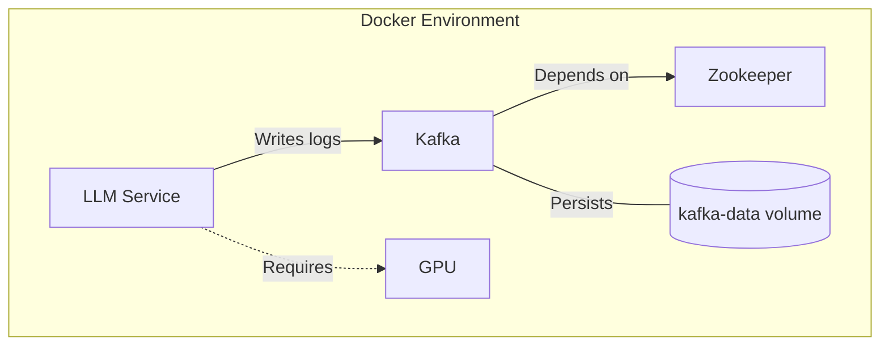

# GPU Logger POC


A system for verifying GPU execution of ML models with immutable logging via Kafka.

## System Overview

### Core Components

1. **GPU Monitoring**
   - Requires CUDA-capable GPU
   - Hardware verification via nvidia-smi
   - Verifies GPU availability and computation
   - Measures operation execution times
   - Compares GPU vs CPU performance
   - Validates tensor operations on GPU

2. **Immutable Logging**
   - Uses Kafka for reliable logging
   - Trait-based abstraction for testing
   - Timestamps all operations
   - Records operation details and performance metrics
   - Preserves operation history in kafka-data volume

3. **Performance Verification**
   - Hardware capabilities inspection via nvidia-smi
   - Operation execution times
   - Device type verification
   - GPU vs CPU performance comparison
   - Matrix multiplication benchmarking
     - 2000x2000 matrices for production verification
     - 100x100 matrices for faster unit tests

### Design Philosophy

The system prioritizes reliable GPU execution verification:
- Direct GPU monitoring through Candle
- Hardware verification through nvidia-smi
- Native Kafka integration for immutable logs
- Trait-based logging abstraction for testing
- Strict GPU requirements for tests
- Focus on GPU performance validation

## Setup Requirements

```bash
# Install Rust
curl --proto '=https' --tlsv1.2 -sSf https://sh.rustup.rs | sh

# CUDA toolkit and nvidia-smi are required
# Install CUDA toolkit appropriate for your system
# See: https://developer.nvidia.com/cuda-downloads

# For Docker with GPU support
sudo apt install nvidia-container-toolkit
sudo systemctl restart docker

# For unit tests running locally
sudo apt install cmake

# Kafka is required for logging (if running locally)
# Or use provided docker-compose setup
```

## Running Tests

```bash
# Run unit tests locally with MockLogger (requires CUDA GPU)
cargo test

docker-compose build

# Run integration tests and ignored tests with Kafka in Docker
docker-compose up test  # This runs tests marked with #[ignore]

# Run specific integration test
docker-compose run test cargo test --test integration_test -- --ignored --nocapture

# Run specific ignored unit test
docker-compose run test cargo test test_logger -- --ignored --nocapture

# Tests will fail if no GPU is available
# All tests explicitly verify GPU performance
```

## Docker Environment

The project includes a complete Docker setup with:
- Kafka and Zookeeper services
- NVIDIA GPU runtime support
- Test container with cargo caching
- Health checks for dependencies
- Persistent Kafka logs in kafka-data volume

To use Docker for testing:
```bash
docker-compose build

# For normal operation with persistent Kafka data
docker-compose up

# For running tests with a separate test volume
docker-compose run test

# Clean up data between runs, e.g. Container "b4e44781be7d" is unhealthy
docker-compose down -v

# Or run specific services
docker-compose up -d kafka  # Start Kafka only
docker-compose up llm-service  # Run main service
```

## Docker Architecture



### Inspecting Kafka Logs

You can inspect the Kafka logs using the following commands:

```bash
# List all available topics
docker-compose exec kafka kafka-topics --bootstrap-server kafka:29092 --list

# Read messages from gpu-monitor topic (from beginning)
docker-compose exec kafka kafka-console-consumer --bootstrap-server kafka:29092 --topic gpu-monitor --from-beginning

# Read only new messages as they arrive
docker-compose exec kafka kafka-console-consumer --bootstrap-server kafka:29092 --topic gpu-monitor

# Read messages with timestamps
docker-compose exec kafka kafka-console-consumer --bootstrap-server kafka:29092 --topic gpu-monitor --property print.timestamp=true --from-beginning

# Read all messages with keys and timestamps
docker-compose exec kafka kafka-console-consumer --bootstrap-server kafka:29092 --topic gpu-monitor --property print.key=true --property key.separator=: --property print.timestamp=true --from-beginning
```

The Kafka logs are persisted in a Docker volume named `kafka-data`. You can find its location on your host machine using:

```bash
docker volume inspect gpu_logger_poc_kafka-data
```

## Usage Example

```rust
use candle_core::Device;

let device = Device::cuda_if_available(0).expect("GPU required");
let monitor = GpuMonitor::new(device, logger);

// Verify GPU hardware
let gpu_info = monitor.verify_gpu_info()?;
println!("GPU Info: {}", gpu_info);  // Shows GPU name, UUID, clocks, etc.

// Verify GPU computation
let is_working = monitor.verify_gpu_compute().await?;
assert!(is_working, "GPU must perform significantly better than CPU");

// Log custom GPU operations
let result = monitor.log_operation(
    "matrix_multiply",
    &[2000, 2000],
    || perform_gpu_operation()
).await?;
```

## Monitoring Output

The system logs operations to Kafka with timestamps and unique keys:

```json
{
    "timestamp": "2024-01-XX...",
    "action": "gpu_operation",
    "component": "gpu_monitor",
    "details": "Operation: matrix_multiply, Input Shape: [2000, 2000], Time: 123ms, Device: Cuda(0)"
}
```

## Verification Methods

The system verifies GPU execution through:
1. Hardware verification using nvidia-smi
   - GPU name and UUID
   - PCI bus ID
   - Maximum SM and memory clocks
2. Performance verification
   - Explicit CUDA device requirement
   - Performance comparison using matrix multiplication
   - Validation of tensor operations
   - Requiring GPU performance to be at least 2x faster than CPU
   - No CPU fallback - tests fail if GPU is not available

## Requirements

- NVIDIA GPU with CUDA support
- CUDA toolkit and nvidia-smi installed
- Docker with NVIDIA Container Toolkit (for Docker usage)
- Kafka instance for logging (provided via Docker)
- Rust toolchain with CUDA support

## Possible next steps

- Model loading and inference support
- Model execution verification
- Performance metrics for model operations

## Kafka Log Immutability Features

The system leverages several Kafka features that ensure log integrity:

1. **Offset-Based Sequencing**
   - Every message has a unique, sequential offset number
   - Offsets cannot be modified or reordered
   - Gaps in sequences indicate tampering attempts
   - Consumer groups track these offsets, making skip detection trivial

2. **Partition Log Structure**
   - Logs are append-only within partitions
   - Messages are written sequentially to disk
   - Previous messages cannot be modified without corrupting the entire log
   - Each message includes a CRC32 checksum

3. **Message Timestamps**
   - Two timestamp types: creation time and log append time
   - Broker-side timestamps cannot be forged by producers
   - LogAppendTime is set by the broker, not the client
   - Timestamp validation prevents out-of-order messages

4. **Retention Policies**
   - Immutable retention period can be set
   - Messages cannot be deleted before retention period expires
   - Deletion only occurs through automated policies
   - Segment-based storage prevents selective message deletion

5. **Replication Features**
   - Messages are replicated across multiple brokers
   - In-sync replicas maintain identical logs
   - Replication factor makes tampering detectable
   - Leader/follower model ensures consistency

To forge logs, an attacker would need to:
- Break the offset sequencing
- Bypass broker timestamp validation
- Corrupt all replica copies
- Recalculate all checksums
- Maintain partition consistency